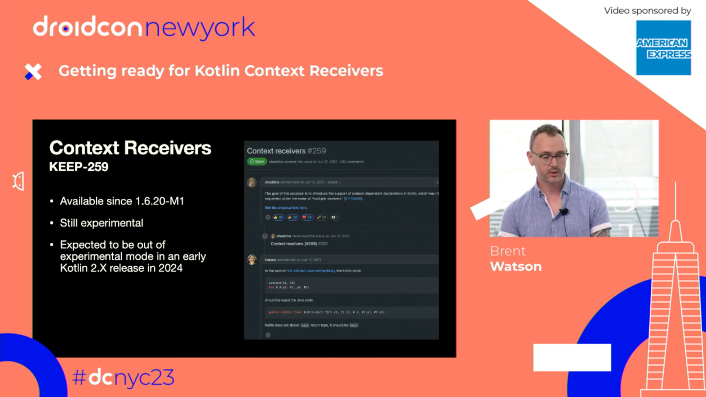

<!-- _class: invert -->

<style scoped>
 h1 { text-align: left; font-size: 100px }
 h2 { text-align: left; font-size: 60px; }
 h3 { text-align: right; font-size: 26px; margin-top: 250px; }
 img { position: absolute; left: 0; bottom: 0; width: 400px; height: auto; }
</style>
# DroidCon NYC 2025
## Playing with Experimental Kotlin Features
### Brent Watson - American Express, _Staff Engineer_

<!-- bottom left corner -->


---
<!-- paginate: true -->

# Level-set...
## Who has heard of KEEPs?

---

# We've seen the language evolve...
* Sealed Classes
* Sealed Interfaces
* Contracts

---

# More recently...
* Coroutines
* `Enum.values()` -> `Enum.entries` (2.0.0)
* Data objects (1.9.0)
* RangeUntil operator `..<` (1.7.20)
* Definitely non-nullable types (1.7.0)

---

<style scoped>
 h1 { text-align: center; }
 h2 { text-align: center; font-size: 100px; }
 ul li{ display: inline; }
 li {font-size: 40px; padding: 70px; }
 li {font-size: 40px; padding: 70px; }

</style>
# Best place to find information about Kotlin language features and proposals?
## 🔎

* KEEPS?
* YouTrack?
* Kotlin Docs?

---

# What are KEEPs?

**K**otlin **E**volution and **E**nhancement **P**rocess

https://github.com/Kotlin/KEEP
https://kotlinlang.org/docs/keep.html

* ➡️ISSUES: Current in-progress KEEPs
* ️➡️PRS: New KEEPs and additions to current KEEPs
* ➡️When KEEPs are implemented, the corresponding design documents are merged into this repository and stored in "proposals" dir.

--- 
# How many open KEEPs are there?

    49  Open KEEPs
    118 Closed KEEPs
    40  Open Changes to KEEPs
    
--- 

# 49?

---

## Turns out KEEPs are not the most accurate place / only place...

<style scoped>
 ul { list-style-type: none; display: flex;}
  li {
    flex: 1;
  }
</style>


* **Should be closed**:
  • Data objects
  • Contracts
  • ...etc...
* **No KEEPs for**:
  • Union types/Rich Errors (2.4)
  • Name-based destructuring (2.4)
  • ...etc...

---
<style scoped>
 h2 { text-align: center; }
</style>

## YouTrack?

--- 
<style scoped>
 h2 { text-align: center; }
</style>

## Good Luck

---

**WebSite**: Kotlin language features and proposals

https://kotlinlang.org/docs/kotlin-language-features-and-proposals.html

---
<style scoped>
 ul { list-style-type: none; padding-left: 200px; }
</style>

# Language Features and Proposals:
* Exploration and design -> 
* &emsp;&emsp;&emsp; KEEP discussion -> 
* &emsp;&emsp;&emsp; &emsp;&emsp;&emsp; In preview -> 
* &emsp;&emsp;&emsp; &emsp;&emsp;&emsp; &emsp;&emsp;&emsp; Stable _(or Revoked)_

---

# Things in "Exploration and design":

* Kotlin statics and static extensions
* Collection literals
* Union types for errors and exceptions ("Rich Errors" -- expected in 2.4)
* Name-based destructuring ("Positional destructuring" -- expected in 2.4)
* Support immutability (multifield value classes)

---

# Things in "KEEP discussion":
## 13 Total!
Some interesting Ones...
 
* kotlin.time.Instant
* Common Atomics
* Nested (non-capturing) type aliases
* UUIDs
* Context parameters

---

# Things in "In preview":
- Guard conditions in when-with-subject
- Multidollar interpolation: improved handling of $ in string literals
- Non-local break and continue

---
<style scoped>
 h2 { text-align: center; }
 h3 { text-align: center; }
</style>
# 🧐 But what about ...
## Must use return values (expected in 2.3)
### Not listed on the website! ([KEEP-412](https://github.com/Kotlin/KEEP/issues/412))

---

<style scoped>
 h3 { text-align: center; }
 b { font-size: 45px;}
</style>
### How <b>DO</b> you know which experimental features you can try out!?

---
<style scoped>
 h1 { text-align: center; font-size: 75px; }
</style>

# 💻
Check compiler flags with the "-X" option 
_&emsp;&emsp;&emsp; -X Print a synopsis of advanced options._

```bash
> kotlinc -X
```
---

```bash
❯ kotlinc -X
```

```bash
Usage: kotlinc-jvm <options> <source files>
where advanced options include:
  -Xabi-stability={stable|unstable}
                             When using unstable compiler features such as FIR, use 'stable' to mark generated class files as stable
                             to prevent diagnostics from being reported when using stable compilers at the call site.
                             When using the JVM IR backend, conversely, use 'unstable' to mark generated class files as unstable
                             to force diagnostics to be reported.
  -Xadd-modules=<module[,]>  Root modules to resolve in addition to the initial modules, or all modules on the module path if <module> is ALL-MODULE-PATH.
  -Xallow-no-source-files    Allow the set of source files to be empty.
  -Xallow-unstable-dependencies Do not report errors on classes in dependencies that were compiled by an unstable version of the Kotlin compiler.
  -Xassertions={always-enable|always-disable|jvm|legacy}
                             'kotlin.assert' call behavior:
                             -Xassertions=always-enable:  enable, ignore JVM assertion settings;
                             -Xassertions=always-disable: disable, ignore JVM assertion settings;
                             -Xassertions=jvm:            enable, depend on JVM assertion settings;
                             -Xassertions=legacy:         calculate the condition on each call, the behavior depends on JVM assertion settings in the kotlin package;
                             default: legacy
  -Xbackend-threads=<N>      Run codegen phase in N parallel threads.
                             0 means use one thread per processor core.
                             The default value is 1.
  -Xbuild-file=<path>        Path to the .xml build file to compile.
  -Xcompile-java             Reuse 'javac' analysis and compile Java source files.
  -Xdefault-script-extension=<script filename extension>
                             Compile expressions and unrecognized scripts passed with the -script argument as scripts with the given filename extension.
  -Xdisable-standard-script  Disable standard Kotlin scripting support.
  -Xir-do-not-clear-binding-context
                             When using the IR backend, do not clear BindingContext between 'psi2ir' and lowerings.
  -Xemit-jvm-type-annotations Emit JVM type annotations in bytecode.
  -Xdebug                    Enable debug mode for compilation.
                             Currently this includes spilling all variables in a suspending context regardless of whether they are alive.
                             If API Level >= 2.2 -- no-op.
  -Xir-inliner               Inline functions using the IR inliner instead of the bytecode inliner.
  -Xjvm-enable-preview       Allow using Java features that are in the preview phase.
                             This works like '--enable-preview' in Java. All class files are marked as compiled with preview features, meaning it won't be possible to use them in release environments.
  -Xenhance-type-parameter-types-to-def-not-null
                             Enhance not-null-annotated type parameter types to definitely-non-nullable types ('@NotNull T' => 'T & Any').
  -Xcompile-builtins-as-part-of-stdlib
                             Enable behaviour needed to compile builtins as part of JVM stdlib
  -Xfriend-paths=<path>      Paths to output directories for friend modules (modules whose internals should be visible).
  -Xmultifile-parts-inherit  Compile multifile classes as a hierarchy of parts and a facade.
  -Xmodule-path=<path>       Paths to Java 9+ modules.
  -Xjava-package-prefix      Package prefix for Java files.
  -Xjava-source-roots=<path> Paths to directories with Java source files.
  -Xjavac-arguments=<option[,]> Java compiler arguments.
  -Xjdk-release=<version>    Compile against the specified JDK API version, similarly to javac's '-release'. This requires JDK 9 or newer.
                             The supported versions depend on the JDK used; for JDK 17+, the supported versions are 1.8 and 9–23.
                             This also sets the value of '-jvm-target' to be equal to the selected JDK version.
  -Xjspecify-annotations=ignore|strict|warn
                             Specify the behavior of 'jspecify' annotations.
                             The default value is 'warn'.
  -Xjsr305={ignore/strict/warn}|under-migration:{ignore/strict/warn}|@<fq.name>:{ignore/strict/warn}
                             Specify the behavior of 'JSR-305' nullability annotations:
                             -Xjsr305={ignore/strict/warn}                   global (all non-@UnderMigration annotations)
                             -Xjsr305=under-migration:{ignore/strict/warn}   all @UnderMigration annotations
                             -Xjsr305=@<fq.name>:{ignore/strict/warn}        annotation with the given fully qualified class name
                             Modes:
                             * ignore
                             * strict (experimental; treat like other supported nullability annotations)
                             * warn (report a warning)
  -Xklib=<path>              Paths to cross-platform libraries in the .klib format.
  -Xlambdas={class|indy}     Select the code generation scheme for lambdas.
                             -Xlambdas=indy                  Generate lambdas using 'invokedynamic' with 'LambdaMetafactory.metafactory'.
                                                             A lambda object created using 'LambdaMetafactory.metafactory' will have a different 'toString()'.
                             -Xlambdas=class                 Generate lambdas as explicit classes.
                             The default value is 'indy' if language version is 2.0+, and 'class' otherwise.
  -Xlink-via-signatures      Link JVM IR symbols via signatures instead of descriptors.
                             This mode is slower, but it can be useful for troubleshooting problems with the JVM IR backend.
                             This option is deprecated and will be deleted in future versions.
                             It has no effect when -language-version is 2.0 or higher.
  -Xno-call-assertions       Don't generate not-null assertions for arguments of platform types.
  -Xno-new-java-annotation-targets
                             Don't generate Java 1.8+ targets for Kotlin annotation classes.
  -Xno-optimize              Disable optimizations.
  -Xno-param-assertions      Don't generate not-null assertions on parameters of methods accessible from Java.
  -Xno-receiver-assertions   Don't generate not-null assertions for extension receiver arguments of platform types.
  -Xno-reset-jar-timestamps  Don't reset jar entry timestamps to a fixed date.
  -Xno-source-debug-extension Don't generate the '@kotlin.jvm.internal.SourceDebugExtension' annotation with an SMAP copy on classes.
  -Xno-unified-null-checks   Use pre-1.4 exception types instead of 'java.lang.NPE' in null checks. See KT-22275 for more details.
  -Xextended-compiler-checks Enable additional compiler checks that might provide verbose diagnostic information for certain errors.
                             Warning: This mode is not backward compatible and might cause compilation errors in previously compiled code.
  -Xfragment-refines=<fromModuleName>:<onModuleName>
                             Declare that <fromModuleName> refines <onModuleName> with the dependsOn/refines relation.
  -Xfragment-sources=<fragment name>:<path>
                             Add sources to a specific fragment of a multiplatform compilation.
  -Xfragments=<fragment name> Declare all known fragments of a multiplatform compilation.
  -Xignore-const-optimization-errors
                             Ignore all compilation exceptions while optimizing some constant expressions.
  -Xenable-incremental-compilation
                             Enable incremental compilation.
  -Xinference-compatibility  Enable compatibility changes for the generic type inference algorithm.
  -Xinline-classes           Enable experimental inline classes.
  -Xintellij-plugin-root=<path> Path to 'kotlin-compiler.jar' or the directory where the IntelliJ IDEA configuration files can be found.
  -Xlegacy-smart-cast-after-try Allow 'var' smart casts even in the presence of assignments in 'try' blocks.
  -Xlist-phases              List backend phases.
  -Xmetadata-klib            Produce a klib that only contains the metadata of declarations.
  -Xmetadata-version         Change the metadata version of the generated binary files.
  -Xmulti-dollar-interpolation Enable experimental multi-dollar interpolation.
  -Xmulti-platform           Enable language support for multiplatform projects.
  -Xnested-type-aliases      Enable experimental language support for nested type aliases.
  -Xnew-inference            Enable the new experimental generic type inference algorithm.
  -Xno-check-actual          Do not check for the presence of the 'actual' modifier in multiplatform projects.
  -Xno-inline                Disable method inlining.
  -Xnon-local-break-continue Enable experimental non-local break and continue.
  -Xphases-to-dump           Dump the backend's state both before and after these phases.
  -Xphases-to-dump-after     Dump the backend's state after these phases.
  -Xphases-to-dump-before    Dump the backend's state before these phases.
  -Xphases-to-validate       Validate the backend's state both before and after these phases.
  -Xphases-to-validate-after Validate the backend's state after these phases.
  -Xphases-to-validate-before Validate the backend's state before these phases.
  -Xplugin=<path>            Load plugins from the given classpath.
  -Xcompiler-plugin=<path1>,<path2>[=<optionName>=<value>,<optionName>=<value>]
                             Register a compiler plugin.
  -Xprofile-phases           Profile backend phases.
  -Xrender-internal-diagnostic-names
                             Render the internal names of warnings and errors.
  -Xreport-all-warnings      Report all warnings even if errors are found.
  -Xreport-output-files      Report the source-to-output file mapping.
  -Xreport-perf              Report detailed performance statistics.
  -Xself-upper-bound-inference Support inferring type arguments from the self-type upper bounds of the corresponding type parameters.
  -Xskip-metadata-version-check Allow loading classes with bad metadata versions and pre-release classes.
  -Xskip-prerelease-check    Allow loading pre-release classes.
  -Xstdlib-compilation       Enables special features which are relevant only for stdlib compilation.
  -Xsuppress-api-version-greater-than-language-version-error
                             Suppress error about API version greater than language version.
                             Warning: This is temporary solution (see KT-63712) intended to be used only for stdlib build.
  -Xsuppress-version-warnings Suppress warnings about outdated, inconsistent, or experimental language or API versions.
  -Xsuppress-warning=<WARNING_NAME>
                             Suppress specified warning module-wide.
  -Xunrestricted-builder-inference
                             Eliminate builder inference restrictions, for example by allowing type variables to be returned from builder inference calls.
  -Xuse-fir-experimental-checkers
                             Enable experimental frontend IR checkers that are not yet ready for production.
  -Xuse-fir-ic               Compile using frontend IR internal incremental compilation.
                             Warning: This feature is not yet production-ready.
  -Xuse-fir-lt               Compile using the LightTree parser with the frontend IR.
  -Xuse-k2                   Compile using the experimental K2 compiler pipeline. No compatibility guarantees are provided yet.
  -Xverbose-phases           Be verbose while performing the given backend phases.
  -Xverify-ir={none|warning|error}
                             IR verification mode (no verification by default).
  -Xverify-ir-visibility     Check for visibility violations in IR when validating it before running any lowerings. Only has effect if '-Xverify-ir' is not 'none'.
  -Xwhen-guards              Enable experimental language support for when guards.

Advanced options are non-standard and may be changed or removed without any notice.
```

---

Grep for "experimental" to see which experimental features are available in the compiler:

```bash
> kotlinc -X | grep -i "experimental"
  -Xuse-k2-kapt                Enable the experimental support for K2 KAPT.
  -Xvalue-classes              Enable experimental value classes.
  -Xannotation-target-all      Enable experimental language support for @all: annotation use-site target.
  -Xcontext-parameters         Enable experimental context parameters.
  -Xcontext-receivers          Enable experimental context receivers.
  -Xdirect-java-actualization  Enable experimental direct Java actualization support.
  -Xinline-classes             Enable experimental inline classes.
  -Xmulti-dollar-interpolation Enable experimental multi-dollar interpolation.
  -Xnested-type-aliases        Enable experimental language support for nested type aliases.
  -Xnew-inference              Enable the new experimental generic type inference algorithm.
  -Xnon-local-break-continue   Enable experimental non-local break and continue.
  -Xuse-k2                     Compile using the experimental K2 compiler pipeline. No compatibility guarantees are provided yet.
  -Xwhen-guards                Enable experimental language support for when guards.
```

---
<style scoped>
 ul { list-style-type: none; }
 li { padding-bottom: 15px; }
 b { text-align: center; font-size: 45px;}
</style>

* ✅ KEEPS
* ✅ YouTrack
* ✅ WebSite
* ✅ Compiler Flags
* &nbsp;
* <b>LETS CODE!...</b>

---

# Which of these are we going to look at?
- `-Xmulti-dollar-interpolation` (2.2)
- `-Xwhen-guards` (2.2)
- `-Xnon-local-break-continue` (2.2)
- `-Xannotation-target-all`
- `-Xcontext-parameters / -Xcontext-receivers`
- `-Xnested-type-aliases`
- `-Xreturn-value-checker`

---

# PLUS: Some things that have been announced that aren't in the compiler yet!
- Named-based destructuring (Experimental in 2.4)
- Rich errors (Experimental in 2.4)
- Must-use return values (Experimental in 2.3 w/ an Opt-In annotation)

---

# Should you use these features?️
- ⚠️  **Experimental**: try it only in toy projects
- 😬  **Alpha**: Use at your own risk, expect migration issues
- 🤷 **Beta**: Will do their best to minimize migration issues, but not unavoidable
- 👍🏻 **Stable**: Use in production without worry

-----------

<!-- class: invert -->
<style scoped>
 h1 { text-align: center; font-size: 150px; }
</style>
# 🧑🏼‍💻

---
<style scoped>
 h1 { text-align: center; }
</style>
# 2.2 Things...

---

# Multi-dollar interpolation
2.2 (Already available!)
`-Xmulti-dollar-interpolation` (`<=2.1`)

#### The problem: 
```kotlin
  val product = "My Product"
  val jsonSchema: String = $"""
  {
    "$schema": "https://json-schema.org/draft/2020-12/schema",
    "$id": "https://example.com/product.schema.json",
    "title": "Product",
    "description": "A $product in the catalog",
    "type": "object"
  }
  """
```

Temp Fix: You could use `${'$'}`

---

# Multi-dollar interpolation
2.2 (Already available!)
`-Xmulti-dollar-interpolation` (`<=2.1`)

#### The problem:
```kotlin
  val product = "My Product"
  val jsonSchema: String = $$"""
  {
    "$schema": "https://json-schema.org/draft/2020-12/schema",
    "$id": "https://example.com/product.schema.json",
    "title": "Product",
    "description": "A $$product in the catalog",
    "type": "object"
  }
  """
```

---
<style scoped>
  pre > code {
    font-size: 15px !important;
  }
</style>

# Guard conditions
2.2 (Already available) // `-Xwhen-guards`

```kotlin
sealed interface Animal {
  data class Cat(val mouseHunter: Boolean) : Animal {
    fun feedCat() = println("Cat fed")
  }
  data class Dog(val breed: String) : Animal {
    fun feedDog() = println("Dog fed")
  }
}

fun feedAnimal(animal: Animal) {
  when (animal) {
    is Animal.Dog -> animal.feedDog()
    is Animal.Cat if animal.mouseHunter -> animal.feedCat()
    else -> println("Unknown animal")
  }
}
fun main() { feedAnimal(Cat(true)) }
```

---
<style scoped>
  pre > code {
    font-size: 15px !important;
  }
</style>

# Guard conditions
2.2 (Already available) // `-Xwhen-guards`

```kotlin
sealed class Status {
    object Loading : Status()
    data class Ok(val info: List<String>) : Status()
    data class Error(val problem: Problem) : Status()
}
 
enum class Problem { CONNECTION, AUTHENTICATION }


```

---
<style scoped>
  pre > code {
    font-size: 15px !important;
  }
</style>
# Guard conditions
2.2 (Already available) // `-Xwhen-guards`

```kotlin
sealed class Status {
    object Loading : Status()
    data class Ok(val info: List<String>) : Status()
    data class Error(val problem: Problem) : Status()
}
 
enum class Problem { CONNECTION, AUTHENTICATION }
 
fun render(status: Status): String = when (status) {
    Status.Loading -> "loading"
    is Status.Ok if status.info.isEmpty() -> "no data"
    is Status.Ok -> status.info.joinToString()
    is Status.Error if status.problem == Problem.CONNECTION -> "problems with connection"
    is Status.Error if status.problem == Problem.AUTHENTICATION -> "could not be authenticated"
    else -> "unknown problem"
}
```

---

### Non-local break and continue
2.2 (Already available) // `-Xnon-local-break-continue`

```kotlin
fun main() = processList(listOf(3, 2, 1, 0))
 
fun processList(elements: List<Int>): Boolean {
    for (element in elements) {
        val variable = element.nullableMethod() ?: run {
            println("Element is null or invalid, continuing...")
            continue // Non-local break/continue statement (in lambda)!
        }
        if (variable == 0) return true
    }
    return false
}
 
private fun Int.nullableMethod() = if (this == 1) null else {
    println(this)
    this
}
```

---

# Context Parameters
support for context-dependent declarations (2.1 experimental status)
Kotlin 2.2 -- Beta Status. Stable in 2.3 // ~~`-Xcontext-receivers`~~ `-Xcontext-parameters`
https://www.droidcon.com/2023/10/06/getting-ready-for-kotlin-context-receivers/



---

# Context Parameters
2.2 - Beta. 2.3 - Stable // `-Xcontext-parameters`

```kotlin
context(logger: Logger)
fun Person.performSomeAction() {
    logger.log("Starting")
}

context(logger: Logger)
fun Person.getBalance() {
  logger.log("Getting Balance")
}

with(Logger(filePath = ...)) {
    person.performSomeAction()
    person.getBalance()
}
```

---

# Context Parameters
2.2 - Beta. 2.3 - Stable // `-Xcontext-parameters`

Use "_" when you want the context param implicitly in the scope:

```kotlin
context(_: Density) val DpOffset.asPx: Offset
    get() = Offset(x.toPx(), y.toPx())
                      ^----------^----- toPx() is an extension function in Density interface
```

_Only makes sense to call `asPx` when an item is in a Density context. But we can't modify Density interface, because we don't own it._

---

# Context Parameters
2.2 - Beta. 2.3 - Stable // `-Xcontext-parameters`

* Requiring things to be in context when being called
* Scopes
* DSLs
* DI

---

<style scoped>
  h1 { text-align: center; }
</style>

# 2.3

---

# Must-use Return Values
Kotlin 2.3 // `-Xreturn-value-checker={check|full|disable}`

Annotations:

* `@CheckReturnValue` - file or class level (required due to "high migration costs")
* `@IgnorableReturnValue` - function level


Will be used _everywhere_!

--- 
<style scoped>
 ul li { list-style-type: none; }
</style>

# Must-use Return Values
Kotlin 2.3 // `-Xreturn-value-checker={check|full|disable}`

JetBrains will be updating:
- stdlib
- kotlinx libs

"If a function returns a value, it does so for a reason."

* `val result = person?.charge(aJillionDollars)  // OK`
* `person?.charge(aJillionDollars) // New: Compiler Error 💥`
* `val _ = person?.charge(aJillionDollars)  // How to ignore`

---

# Must-use Return Values
Kotlin 2.3 // `-Xreturn-value-checker={check|full|disable}`

Very similar to Go.

```go
func main() {
    person := &Person{}
    person.charge(aJillionDollars) // Error
    
    err := person.charge(aJillionDollars)
    if err != nil {
        fmt.Println("Charge failed:", err)
    }
    
    ~OR~
    _ := person.charge(aJillionDollars) // Ignore
}
```

---
<style scoped>
 ul li { list-style-type: none; }
</style>

# Nested (non-capturing) type aliases
Experimental in Kotlin 2.2. Beta in 2.3 // `-Xnested-type-aliases`

* 2.2:
    ```kotlin
    typealias ResponseData = Map<String, Map<String, List<Int>>> 👍🏻
    class Service {
      typealias ResponseData = Map<String, Map<String, List<Int>>> 💥
    }
    ```
* 2.3:
    ```kotlin
    typealias ResponseData = Map<String, Map<String, List<Int>>> 👍🏻
    class Service {
      typealias ResponseData = Map<String, Map<String, List<Int>>> 👍🏻
    }
    ```
  
---
<style scoped>
 h1 { text-align: center; }
</style>

# 2.4

--- 
<style scoped>
 ul li { list-style-type: none; }
 h3 { text-align: center; }
</style>

# Name-based destructuring
Experimental in 2.4 // (No compiler flag yet)
### Mentioned during KotlinConf Keynote

* Before: `val (first, last) = person`
* Now :&nbsp;&nbsp; `(val name, val last) = person`

---
<style scoped>
 ul li { list-style-type: none; }
 h3 { text-align: center; }
</style>

# Rich errors ("Union types for errors and exceptions")
[KT-68296](https://youtrack.jetbrains.com/issue/KT-68296)
Experimental in 2.4 / No compiler flag yet
### Mentioned during KotlinConf Keynote

```kotlin


```
---
<style scoped>
 ul li { list-style-type: none; }
 h3 { text-align: center; }
</style>

# Rich errors ("Union types for errors and exceptions")
[KT-68296](https://youtrack.jetbrains.com/issue/KT-68296)
Experimental in 2.4 / No compiler flag yet
### Mentioned during KotlinConf Keynote

```kotlin
fun findPerson(): Person? {}
fun Person.charge(amount: Double): Balance? {}
```
---
<style scoped>
 ul li { list-style-type: none; }
 h3 { text-align: center; }
</style>

# Rich errors ("Union types for errors and exceptions")
[KT-68296](https://youtrack.jetbrains.com/issue/KT-68296)
Experimental in 2.4 / No compiler flag yet
### Mentioned during KotlinConf Keynote

```kotlin
fun findPerson(): Person | LookupError {}
fun Person.charge(amount: Double): Balance | ChargeError {}
```
              
---

# Rich errors ("Union types for errors and exceptions")

Add a new "error modifier" on regular types:

```kotlin
error object LookupError
error class ChargeError(val message: String)
```

---

# Rich errors ("Union types for errors and exceptions")

Conditionals require handling any possible Union types:

```kotlin
when(result) {
    is Balance -> println("OK!")
    is LookupError -> println("Person not found")
    is ChargeError -> println("Charge failed: ${result.message}")
}
```
---

# Rich errors ("Union types for errors and exceptions")

```kotlin
error object LookupError
error class ChargeError(val message: String)

fun findPerson(): Person | LookupError {}
fun Person.charge(amount: Double): Balance | ChargeError {}

val results = findPerson()?.charge(100.0)

when(result) {
    is Balance -> println("OK!")
    is LookupError -> println("Person not found")
    is ChargeError -> println("Charge failed: ${result.message}")
}
```

---

# Rich errors ("Union types for errors and exceptions")

Much safer than what we do now:

```kotlin
fun findPerson(): Person? {}
fun Person.charge(amount: Double): Balance? {}

val results = findPerson()?.charge(100.0)

when(result) {
  is Balance -> println("OK!")
  is null -> // Hmmmmm 🤔
}
```
---

<style scoped>
  li { font-size: 30px; }
  img {
    position: absolute;
    right: 100px;
    top: 50%;
    transform: translateY(-50%);
    width: 300px;
    height: auto;
  }
</style>

# Today we looked at:
- Multi-dollar interpolation
- Guard conditions
- Non-local break and continue
- Context parameters
- Must-use return values
- Nested (non-capturing) type aliases
- Name-based destructuring
- Rich errors ("Union types for errors and exceptions")


---

<style scoped>
 h1 { text-align: center; font-size: 100px; }
</style>

# Thank You!
